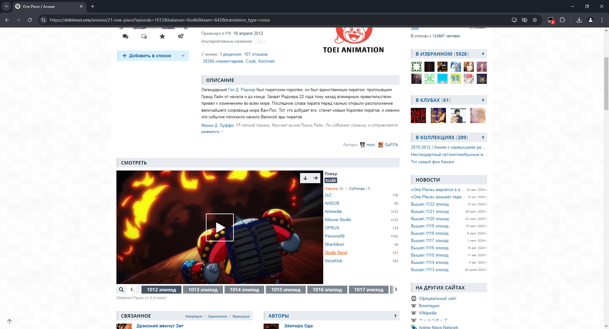

# Shikimori Player

Добавляет плееры для просмотра аниме на сайте shikimori.one в стиле anilib

Почти вся функциональность плеера взята с anilib

## Пред. просмотр

[Видео](https://imgur.com/gallery/shikimori-player-preview-5HgH5hi)

## Как установить

У вас должен быть установлен [Tampermonkey](https://www.tampermonkey.net/) или другое похожее расширение

Далее перейдите по этой ссылке: https://raw.githubusercontent.com/lijspoop/shikimori-player/refs/heads/build/shikimori-player.user.js

Откроется страница и кликните `Установить`, затем перезагрузите сайт shikimori и перейдите на страницу аниме.

Ниже описания должен появится плеер, если его нет, то это может значить, что скрипт выключен или требуется включить режим разработчика в расширениях.
